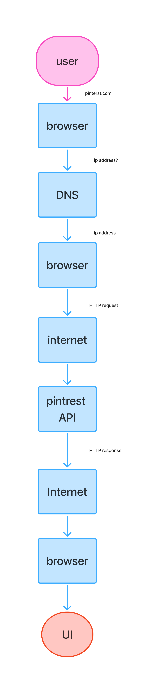

# # Pinterest Request Journey

This diagram explains what happens when a user enters `pinterest.com` in the browser and presses Enter.

## Request Journey

The journey starts with the user and ends when the Pinterest interface is displayed.

1. **User**
   
   The user enters `pinterest.com` in the browser and presses Enter.

2. **Browser**
   
   The browser receives the website address and needs to find the IP address of the website.

3. **DNS**
   
   The browser sends a request to the DNS to find the IP address associated with `pinterest.com`.

4. **Browser**
   
   The DNS returns the IP address to the browser.

5. **HTTP Request**
   
   The browser sends an HTTP request to Pinterest's server using the IP address.

6. **Internet**
   
   The request travels through the internet until it reaches Pinterest's server.

7. **Pinterest API / Backend**
   
   Pinterest receives the request and processes it.

8. **HTTP Response**
   
   After processing the request, Pinterest sends an HTTP response back through the internet.

9. **Browser**
   
   The browser receives the response from Pinterest.

10. **UI**
    
    The browser uses the response to display the Pinterest user interface to the user.

## Simple Flow

